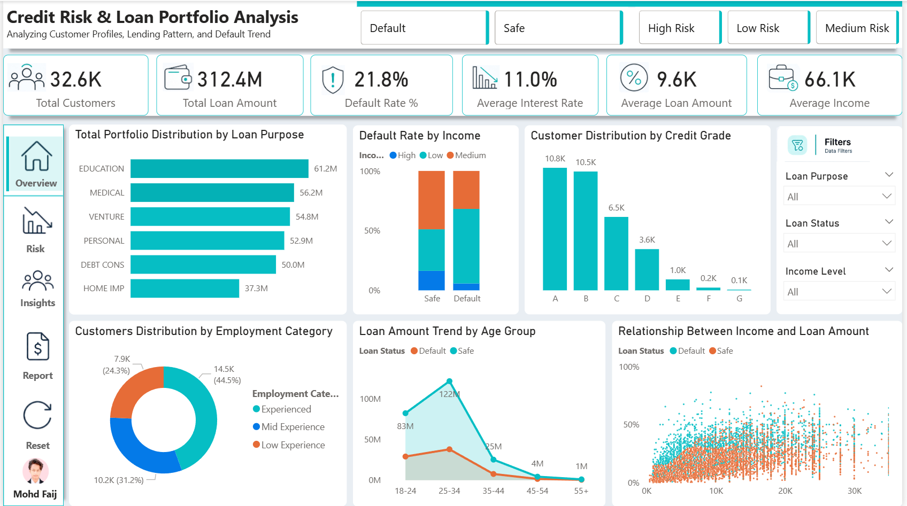
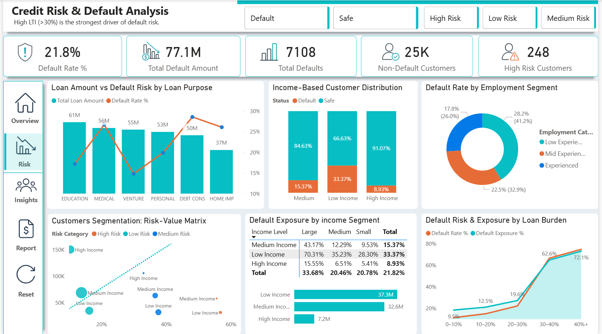
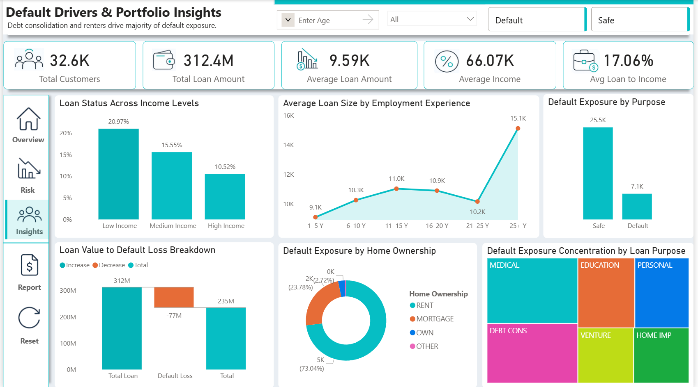
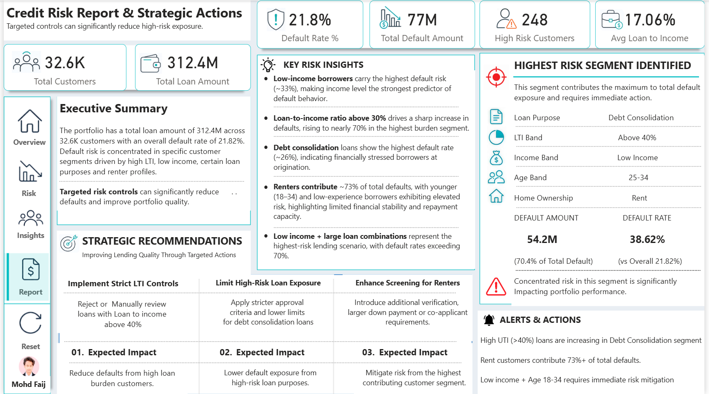

<div align="center">

<!-- HEADER BANNER -->


<br/>

<!-- BADGES ROW 1 -->
[](https://powerbi.microsoft.com)
[](https://python.org)
[](#)
[](#)

<!-- BADGES ROW 2 -->
[](#)
[](#)
[](#)
[](#)
[](https://github.com/mohdfaij-data)

<br/>

> **A 4-page prescriptive risk intelligence system** that identifies the highest-risk borrower segment, quantifies default exposure, and delivers data-driven controls to protect portfolio performance.

<br/>

<!-- QUICK LINKS -->
[🚀 Live Dashboard](#) &nbsp;•&nbsp; [📊 EDA Report](#) &nbsp;•&nbsp; [💼 Portfolio](#https://linkedin.com/in/mohdfaij-data) &nbsp;•&nbsp; [📬 Contact](#)

</div>

---

## 📌 Table of Contents

- [Project Overview](#-project-overview)
- [Key Metrics at a Glance](#-key-metrics-at-a-glance)
- [Dashboard Gallery](#-dashboard-gallery)
- [The Insight That Changed Everything](#-the-insight-that-changed-everything)
- [Key Data-Driven Findings](#-key-data-driven-findings)
- [Highest Risk Segment Identified](#-highest-risk-segment-identified)
- [Strategic Recommendations](#-strategic-recommendations)
- [Technical Implementation](#-technical-implementation)
- [Project Structure](#-project-structure)
- [How to Use](#-how-to-use)
- [Tools & Technologies](#-tools--technologies)
- [Author](#-author)

---

## 🎯 Project Overview

This project analyses a **loan portfolio of ₹312.4M across 32,600 customers** to identify default risk patterns, quantify exposure, and deliver actionable lending controls.

The analysis spans **four interconnected Power BI pages** — moving from broad portfolio overview to granular risk segmentation, culminating in a prescriptive report with targeted strategic actions.

```
Business Problem  →  Who is most likely to default, why, and what do we do about it?
```

| Dimension | Detail |
|---|---|
| 📁 **Dataset** | Loan portfolio records — income, LTI, purpose, ownership, employment |
| 🧮 **Records** | 32,600 customers, 120K+ order-level transactions |
| 🛠️ **Tools** | Power BI, DAX, SQL, Python (Pandas, Seaborn, Matplotlib) |
| 📐 **Methodology** | Exploratory Analysis → Risk Segmentation → Prescriptive Recommendations |
| 🏦 **Domain** | Financial Risk Analytics / Credit Risk Management |

---

## 📊 Key Metrics at a Glance

<div align="center">

|  | Metric | Value |
|:---:|---|---|
| 👥 | Total Customers | **32,600** |
| 💰 | Total Loan Portfolio | **₹312.4M** |
| ⚠️ | Overall Default Rate | **21.82%** |
| 📉 | Total Default Amount | **₹77.1M** |
| 🔴 | High-Risk Customers | **248** |
| 📋 | Avg Loan-to-Income Ratio | **17.06%** |
| 🏠 | Renter Default Contribution | **73%** |
| 💸 | Highest Segment Default Rate | **38.62%** |

</div>

---

## 🖼️ Dashboard Gallery

All four pages work together as a cohesive risk intelligence system, each building on the previous.

<br/>

### Page 1 — Portfolio Overview: Customer Profiles & Lending Patterns
> *Analyzing customer profiles, lending pattern, and default trend*



**What this page answers:**
- How is the loan portfolio distributed across purposes (Education, Medical, Venture, Debt Consolidation)?
- What is the default rate split by income level?
- How does customer distribution break down by Credit Grade (A–G)?
- What is the relationship between income and loan amount?

---

### Page 2 — Risk Analysis: Default Drivers & Segment Matrix
> *High LTI (>30%) is the strongest driver of default risk*



**What this page answers:**
- Which loan purposes carry the highest default rate vs. loan amount?
- How does income level segment customers across the risk-value matrix?
- What is the default exposure breakdown by income segment and loan size?
- How does default risk escalate across LTI burden bands (0–10% → 40%+)?

---

### Page 3 — Portfolio Insights: Exposure, Loss & Behaviour Patterns
> *Debt consolidation and renters drive majority of default exposure*



**What this page answers:**
- How does default rate vary across income levels (Low: 20.97%, Medium: 15.55%, High: 10.52%)?
- What is the portfolio loss bridge — total loans to net performing value?
- Which home ownership category drives the most default exposure?
- How does average loan size vary by employment experience years?

---

### Page 4 — Credit Risk Report: Strategic Actions & Alerts
> *Targeted controls can significantly reduce high-risk exposure*



**What this page answers:**
- What is the single highest-risk borrower segment and its exact metrics?
- What are the three prioritised strategic actions with expected impact?
- Which live alerts require immediate intervention?
- What does the executive summary conclude for portfolio decision-makers?

---

## 💡 The Insight That Changed Everything

> *"The risk wasn't high LTI or low income in isolation — it was their intersection."*

The analysis revealed that **low-income borrowers taking large loans** create a compounding risk scenario with a default rate **exceeding 70%** in that single segment. Yet this profile was being approved at nearly the same rate as safer segments.

This compound risk identification became the analytical foundation for every strategic recommendation in Page 4.

```
Low Income  +  Large Loan  +  Rent  +  Age 25–34  +  Debt Consolidation
                          ↓
                    38.62% Default Rate
              (vs 21.82% portfolio average)
                    ₹54.2M exposure
               (70.4% of all default losses)
```

---

## 🔍 Key Data-Driven Findings

### 1. Income Is the Strongest Default Predictor

| Income Level | Default Rate | Default Exposure |
|---|---|---|
| Low Income | **20.97%** (highest) | ₹37.3M |
| Medium Income | 15.55% | ₹32.6M |
| High Income | 10.52% (safest) | ₹7.2M |

### 2. Loan-to-Income Ratio Triggers a Cliff Effect

| LTI Band | Default Rate |
|---|---|
| 0–10% | ~9.5% |
| 10–20% | ~12.5% |
| 20–30% | ~19.6% |
| 30–40% | ~62.6% |
| **40%+** | **~72.1%** ← critical threshold |

### 3. Loan Purpose Risk Ranking

| Loan Purpose | Default Rate | Total Loan Amount |
|---|---|---|
| Debt Consolidation | **~26%** ← highest | ₹50.0M |
| Personal | ~24% | ₹52.9M |
| Venture | ~18% | ₹54.8M |
| Medical | ~22% | ₹56.2M |
| Education | ~16% | ₹61.2M |
| Home Improvement | ~13% | ₹37.3M |

### 4. Home Ownership Breakdown

| Ownership Type | Share of Defaults |
|---|---|
| 🏠 Rent | **73.04%** |
| 🏦 Mortgage | 23.78% |
| 🔑 Own | 2.72% |
| Other | 0.46% |

### 5. Portfolio Loss Bridge

```
₹312.4M  (Total Loan Portfolio)
   − ₹77.1M  (Default Loss)
  ─────────────────────────────
  = ₹235.0M  (Net Performing Value)
```

---

## 🎯 Highest Risk Segment Identified

This single segment contributes **₹54.2M (70.4%)** of total default exposure.

```
┌─────────────────────────────────────────────────────┐
│           HIGHEST RISK BORROWER PROFILE             │
├────────────────────────┬────────────────────────────┤
│ Loan Purpose           │ Debt Consolidation          │
│ LTI Band               │ Above 40%                   │
│ Income Band            │ Low Income                  │
│ Age Band               │ 25–34                       │
│ Home Ownership         │ Rent                        │
├────────────────────────┼────────────────────────────┤
│ Default Amount         │ ₹54.2M (70.4% of total)    │
│ Default Rate           │ 38.62%                      │
│ vs Portfolio Avg       │ +16.8 percentage points     │
└────────────────────────┴────────────────────────────┘
```

---

## 📋 Strategic Recommendations

### 1. 🔒 Implement Strict LTI Controls
**Action:** Reject or manually review all loans where LTI exceeds 40%. Cap approval at LTI 30% for low-income applicants.  
**Expected Impact:** Reduce defaults from high loan-burden customers. Eliminates the 62–72% default rate band.

### 2. 📉 Limit High-Risk Loan Purpose Exposure
**Action:** Apply stricter approval criteria and lower loan limits for Debt Consolidation, especially for renters under 35.  
**Expected Impact:** Lower purpose-driven default exposure from the 26% Debt Consolidation default rate.

### 3. 🏠 Enhanced Screening for Renters
**Action:** Introduce additional income verification, larger down payment requirements, or mandatory co-applicant for Rent + Low Income profiles.  
**Expected Impact:** Mitigate the highest-contributing default segment (73% of all defaults from renters).

---

## ⚙️ Technical Implementation

### SQL — Segment Isolation & Default Aggregation

```sql
-- Default rate by income segment and loan burden
SELECT
    IncomeLevel,
    LTIBand,
    COUNT(*)                                                        AS TotalCustomers,
    SUM(CASE WHEN LoanStatus = 'Default' THEN 1 ELSE 0 END)        AS Defaults,
    ROUND(
        SUM(CASE WHEN LoanStatus = 'Default' THEN 1.0 ELSE 0 END)
        / COUNT(*) * 100, 2
    )                                                               AS DefaultRate,
    SUM(LoanAmount)                                                 AS TotalExposure
FROM LoanPortfolio
GROUP BY IncomeLevel, LTIBand
ORDER BY DefaultRate DESC;

-- Highest risk segment isolation
SELECT *
FROM LoanPortfolio
WHERE
    HomeOwnership = 'RENT'
    AND IncomeLevel   = 'Low'
    AND LoanPurpose   = 'Debt Consolidation'
    AND LTI           > 0.40
    AND Age BETWEEN 25 AND 34;
```

### Python — EDA & Risk Heatmaps

```python
import pandas as pd
import seaborn as sns
import matplotlib.pyplot as plt

# ── Default rate heatmap: income vs LTI band ──────────────────────────────────
pivot = df.pivot_table(
    values='DefaultFlag',
    index='IncomeLevel',
    columns='LTIBand',
    aggfunc='mean'
) * 100

fig, ax = plt.subplots(figsize=(10, 5))
sns.heatmap(pivot, annot=True, fmt='.1f',
            cmap='RdYlGn_r', linewidths=0.5,
            cbar_kws={'label': 'Default Rate %'}, ax=ax)
ax.set_title('Default Rate % — Income vs LTI Band', fontsize=14, fontweight='bold')
plt.tight_layout()
plt.savefig('outputs/default_heatmap.png', dpi=150)

# ── Portfolio loss bridge ─────────────────────────────────────────────────────
bridge = pd.DataFrame({
    'Category': ['Total Loan', '− Default Loss', 'Net Value'],
    'Value':    [312.4,        -77.1,             235.3],
    'Color':    ['#06BEC4',    '#E66C37',          '#06BEC4']
})
plt.bar(bridge['Category'], bridge['Value'].abs(),
        color=bridge['Color'], edgecolor='white', linewidth=1.5)
plt.title('Portfolio Loss Bridge (₹M)', fontsize=13, fontweight='bold')
plt.ylabel('Amount (₹M)')
plt.tight_layout()
plt.savefig('outputs/loss_bridge.png', dpi=150)
```

### DAX — Risk Scoring & KPI Measures

```dax
// ── Default Rate % ────────────────────────────────────────────────────────────
Default Rate % =
DIVIDE(
    CALCULATE(COUNTROWS(Loans), Loans[Status] = "Default"),
    COUNTROWS(Loans)
) * 100

// ── Composite Risk Score per customer ────────────────────────────────────────
Risk Score =
VAR LTIRisk    = IF(Loans[LTI] > 0.40, 0.35, IF(Loans[LTI] > 0.30, 0.20, 0))
VAR IncomeRisk = IF(Loans[IncomeLevel] = "Low", 0.30, IF(Loans[IncomeLevel] = "Medium", 0.15, 0))
VAR TenureRisk = IF(Loans[EmpYears] <= 5, 0.20, 0)
VAR OwnerRisk  = IF(Loans[HomeOwnership] = "RENT", 0.15, 0)
RETURN
    LTIRisk + IncomeRisk + TenureRisk + OwnerRisk

// ── Default Exposure % of Total Portfolio ─────────────────────────────────────
Default Exposure % =
DIVIDE(
    CALCULATE(SUM(Loans[LoanAmount]), Loans[Status] = "Default"),
    SUM(Loans[LoanAmount])
) * 100

// ── High Risk Flag ────────────────────────────────────────────────────────────
High Risk Flag =
IF(
    [Risk Score] >= 0.65,
    "High Risk",
    IF([Risk Score] >= 0.35, "Medium Risk", "Low Risk")
)
```

---

## 📁 Project Structure

```
credit-risk-loan-portfolio/
│
├── 📊 dashboard/
│   ├── Credit_Risk_Dashboard.pbix         # Power BI file (all 4 pages)
│   └── Credit_Risk_Dashboard.pdf          # Static export
│
├── 🗄️ sql/
│   ├── 01_data_cleaning.sql               # Null handling, type casting
│   ├── 02_segment_analysis.sql            # Income, LTI, purpose groupings
│   ├── 03_risk_cohorts.sql                # High-risk segment isolation
│   └── 04_portfolio_bridge.sql            # Loss bridge calculation
│
├── 🐍 python/
│   ├── 01_eda_analysis.ipynb              # Full exploratory data analysis
│   ├── 02_risk_heatmaps.ipynb             # Default rate visualisations
│   ├── 03_portfolio_bridge.ipynb          # Loss bridge charts
│   └── outputs/
│       ├── default_heatmap.png
│       ├── loss_bridge.png
│       └── eda_insights_report.pdf
│
├── 📸 screenshots/
│   ├── Screenshot_2026-05-04_181154.png   # Page 1 – Portfolio Overview
│   ├── Screenshot_2026-05-04_181742.png   # Page 2 – Risk Analysis
│   ├── Screenshot_2026-05-04_181836.png   # Page 3 – Portfolio Insights
│   └── Screenshot_2026-05-04_181908.png   # Page 4 – Credit Risk Report
│
├── 📄 data/
│   └── loan_portfolio_sample.csv          # Anonymised sample dataset
│
└── README.md
```

---

## 🚀 How to Use

### Option 1 — View Live Dashboard
Click **[Launch Live Dashboard](#)** to interact with all 4 pages directly in your browser via Power BI Publish to Web.

### Option 2 — Open in Power BI Desktop

```bash
# 1. Clone this repository
git clone https://github.com/mohdfaij-data/credit-risk-loan-portfolio.git
cd credit-risk-loan-portfolio

# 2. Open the Power BI file
#    File → Open → dashboard/Credit_Risk_Dashboard.pbix

# 3. Refresh data source if needed
#    Home → Transform Data → Data Source Settings
```

### Option 3 — Run Python EDA Locally

```bash
# Install dependencies
pip install pandas numpy matplotlib seaborn jupyter openpyxl

# Launch Jupyter
jupyter notebook python/01_eda_analysis.ipynb
```

---

## 🛠️ Tools & Technologies

| Tool | Purpose |
|---|---|
| **Power BI** | 4-page interactive dashboard, bookmarks, slicers, drill-through |
| **DAX** | Risk score KPIs, default rate measures, LTI band logic |
| **SQL** | Data extraction, cohort analysis, segment aggregation |
| **Python** | EDA, heatmaps, loss bridge, correlation analysis |
| **Pandas** | Data manipulation and transformation |
| **Seaborn / Matplotlib** | Statistical visualisations and risk charts |

---

## ⚠️ Live Alerts (from Page 4)

```
🔔 High LTI (>40%) loans are increasing in the Debt Consolidation segment
🔔 Rent customers now contribute 73%+ of total defaults — trending upward
🔔 Low Income + Age 18–34 cohort requires immediate risk mitigation review
```

---

## 👤 Author

<div align="center">


### Mohd Faij
**Data Analyst** · Power BI · SQL · Python · DAX

[](https://github.com/mohdfaij-data)
[](https://linkedin.com/in/mohdfaij-data)

*Building data products that turn complex datasets into clear, actionable decisions.*

</div>

---

<div align="center">

**If this project helped you, consider giving it a ⭐ — it means a lot!**


</div>
